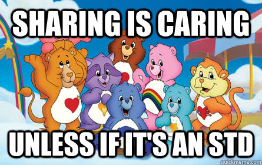

# Intro to intro

## Sharing is caring {.flexbox .vcenter}

*Reading more about STDs is optional

## Main principles of workshops:

Each workshop should be hands-on practise:

- Share information
- Implement
- Figure it out why it is useful and start using it on daily routine

You will never learn anything completely just by looking at presentation.

## 

Possible scenario of any workshop:

>- Trying to understand information
>- Practising
>- Practising
>- Frustration pause
>- Practising
>- Practising
>- Frustration pause
>- Practising
>- Oh, does it work?
>- It works!
>- Champagne -- ba-dum-tss

# Git & GitHub

## What are those Git & GitHub?

Git is version control system designed by Linus Tornvald, the creator of Linux kernel.

GitHub is web-based service for Git.

GitHub is mostly used for simple development of projects using version control. This allows user freely develop alone or with other users. 

Moreover, GitHub is more or less a community, where people share and learn. Many of open source tools firstly appears on GitHub. Then other users could easily report bugs on your project, develop additional features, expand your project scope, *etc*.

##

Q: But I am not a developer, I AM DATA SCIENTIST, why should I use such a tool?

A: Because:

>- You (probably) write code too 
>- You (probably) work on the project with other people
>- You (probably) don't back-up your projects
>- You (probably) would like to access your projects anytime, anywhere
>- You can see this presentation via GitHub

Any more questions?

## Plan of mini workshop

1. Configure GitHub accounts with your computers
2. Create a repository on GitHub
3. Create a file and write something sad 
4. Push that sad file to GitHub
5. Clone your colleagues repository to your computer

## Configuring GitHub

